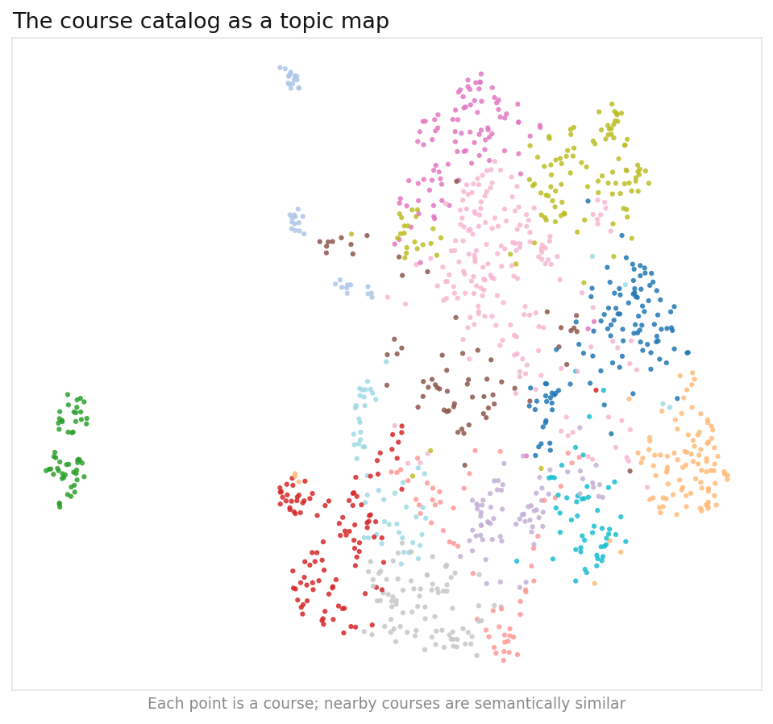
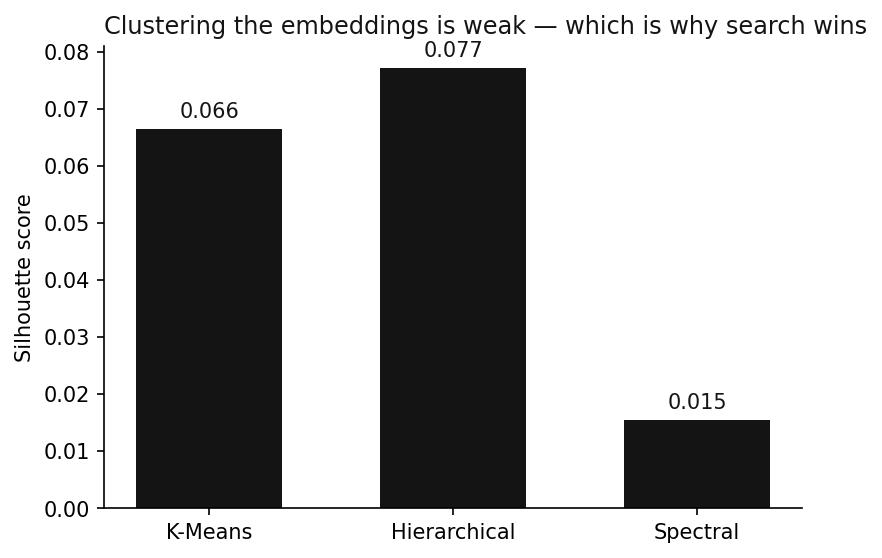

# 🎓 UBC Course Search

Semantic search over the UBC Science catalog (~1,200 courses). Type what you want to learn in
plain English and it finds courses by **meaning, not keywords** — and the whole search runs
**in your browser**.

**▶ [Live demo](https://johnkang0720.github.io/course_recommender/)** — search, "more like this," and an interactive topic map where your results light up.

---

## How it works

Every course description is turned into a vector with a sentence-transformer (MiniLM), so
similar courses land near each other in a 384-dimensional space. Searching is then just
geometry:

1. **Scrape** the catalog (I expanded my original UBC scraper to every subject).
2. **Embed** each course once, offline → one vector per course.
3. At query time, embed *your* text with the **same** model — running in the browser via
   Transformers.js — and return the nearest course vectors by cosine similarity.

It's a **bi-encoder**: one shared text encoder embeds both the query and the courses, because
both sides are just text. No ratings, no behavior data — pure content-based retrieval.

## Search vs. clustering

The original project clustered courses. I kept clustering as a baseline and compared three
methods — but on text embeddings they all score a low silhouette (<0.1): the catalog is one
connected mass of related topics, not tidy islands. That's exactly *why nearest-neighbor
search beats hard clustering here.* K-Means still earns its keep coloring the topic map.





## Run it

```bash
pip install -r requirements.txt
python scripts/build.py    # scrape → embed → cluster → figures → export the demo
pytest -q
```

`build.py` caches the scrape and embeddings, so re-runs are instant.

## Layout

```
coursesearch/
  scrape.py   # scrape the UBC catalog
  embed.py    # MiniLM embeddings, cosine search, clustering + silhouette
  viz.py      # UMAP topic map + clustering comparison
scripts/      # build.py (scrape → embed → export)
docs/         # the in-browser search demo · tests/
```
